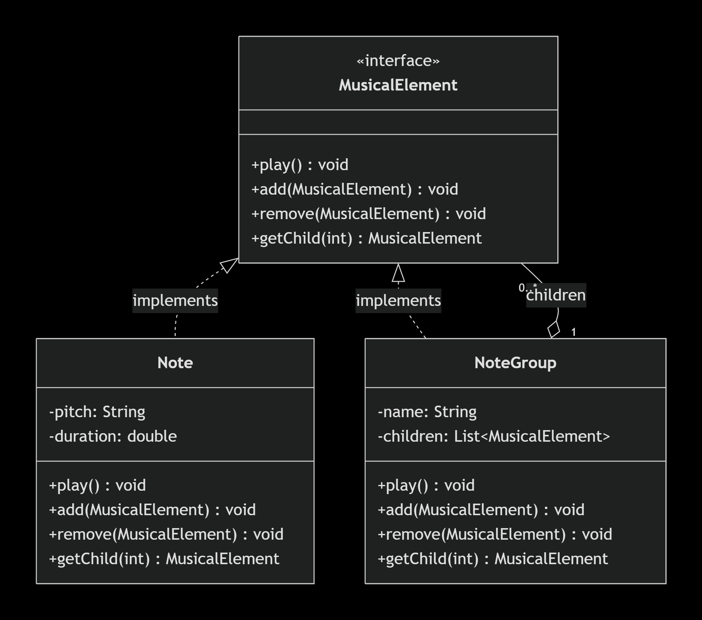

# Music Composite Pattern Project

## Overview
This project demonstrates the **Composite Design Pattern** for a music composition system.  
It allows treating individual notes and groups (chords, tracks) uniformly using the same `play()` interface.

## Project Structure
- `src/components/` → `MusicalElement` interface  
- `src/leaves/` → `Note` class (leaf)  
- `src/composites/` → `NoteGroup` class (composite)  
- `src/client/` → `MusicApp` (main class)

## UML Class Diagram

## How to Run
1. Open the project in VS Code (or NetBeans).  
2. Ensure Java Extension Pack is installed.  
3. Open `src/client/MusicApp.java` and click **Run**.

## Team Members & Contributions
- **Khader Al-Nuble** (Leader) – Code, GitHub, Final packaging  
- **Yousef Hariri** – Problem analysis, trade-offs, SOLID justification  
- **Yahya Khafeer** – UML diagrams, technical documentation  
- **Samer Al-Jaafari** – Implementation, testing, presentation

## Links
- [GitHub Project Board](https://github.com/SDejrboqt/MusicCompositePattern/projects/1)
- [Contribution Log](./CONTRIBUTION_LOG.md)
- [Presentation Slides](./Presentation.pptx)
